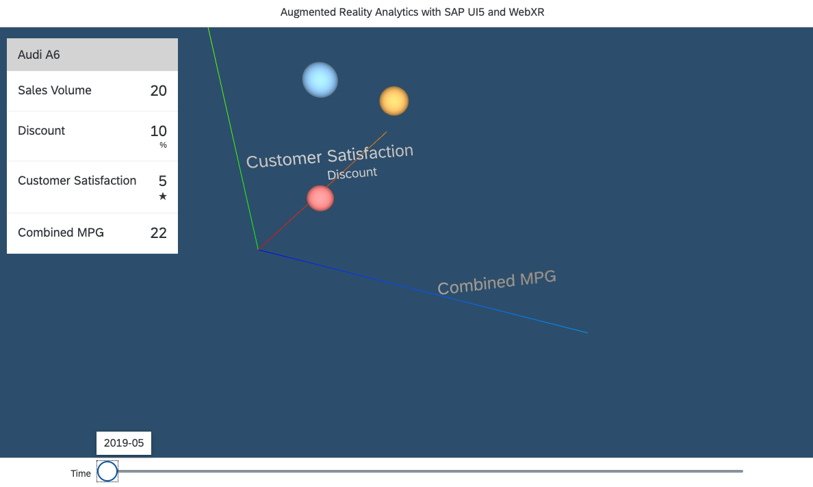

# Develop an Augmented Reality Analytics app with SAP UI5 and WebXR

In this tutorial you'll develop a 3D analytical app in SAP UI5. Through the new web standard WebXR this app will run as an Augmented Reality app on your mobile phone.

## Step 1: Open SAP Web IDE

Click on the ```Start Trial``` button on the following page to get to the SAP Cloud Platform Cockpit and click then on the ```Launch SAP Web IDE``` link to get to the Web IDE.

https://www.sap.com/developer/topics/sap-webide.html

## Step 2: Clone Git Repository into SAP Web IDE

- From the File menu, choose Git  Clone Repository.
- In the URL field, enter the Git repository URL https://github.com/cgrail/arAnalyticsTutorial and press Enter.
- Choose Clone. The cloning starts. When the process is finished, the content of the repository appears in the workspace.

For further information please refer to the [SAP Web IDE documentation](https://help.sap.com/viewer/825270ffffe74d9f988a0f0066ad59f0/CF/en-US/3c7e5f3accbd48d7ab5229bf503317c4.html)

## Step 3: Install WebXR Viewer on your iPhone/iPad

Start the installation of the WebXR Viewer on your iPhone or iPad. You'll need this app later in the process.

https://itunes.apple.com/us/app/webxr-viewer/id1295998056

## Step 4: Run the app on your Desktop and WebXR Viewer

Open “webapp/index.html”; Press “run“ button.

Expected behavior:

You should see a UI5 application with lines for the x (red), y (green) and z (blue) axis. With your mouse you can navigate through the 3D space.


## Step 5: Create Sphere in space

Open the file ```ARAnalytics.controller.js``` which contains the controller of our main view.

Path: ```webapp/controller/ARAnalytics.controller.js```

Create the function ```createSphere()``` which creates a sphere at a given location.

```javascript
createSphere(sphereData) {
  const sizeAndDimension = sphereData.sizeAndDimension[0];
  const scene = this.arView.getScene();
  const geometry = new THREE.SphereGeometry(sizeAndDimension.size, 32, 32);
  const material = new THREE.MeshPhongMaterial({
    color: FioriColors.getNextColor(),
    shininess: 0.7
  });
  const sphere = new THREE.Mesh(geometry, material);
  sphere.userData = sphereData;
  sphere.position.copy(new THREE.Vector3(sizeAndDimension.x, sizeAndDimension.y, sizeAndDimension.z));
  scene.add(sphere);
  return sphere;
}
```

<i>Tip: use short-cut defined in menu "Edit"->"Beautify" to format the code in the editor.</i>

Create the function ```onAfterRendering()``` which is called once the app has been rendered and create a sphere at the 3D location x: 0, y: 0 and z: 0 with a size of 0.1. WebXR is based on the metric system and therefor a size of 0.1 represents 10cm which is about 4" large. To do so, add the following code above last added function ```createSphere()```:

```javascript
onAfterRendering() {
  this.arView = this.byId("arView");
  const sphereData = {
    sizeAndDimension: [{
      x: 0,
      y: 0,
      z: 0,
      size: 0.1
    }]
  };
  this.createSphere(sphereData);
},
```

Open the view of the controller and add the id ```arView``` so that the controller can access the Augmented Reality control.
Path: ```webapp/view/ARAnalytics.view.xml```

```xml
<control:ArView id="arView" />
```

Now you can run the application and you will see a sphere in space at the location 0,0,0.


## Step 6: Read data

For this example we've created [some data](../webapp/data/carData.json) which you can use. You could also create your own data set and load it into the app.  

Path: ```webapp/data/carData.json``` 

> The provided data is sales data for cars. It contains data about the sales volume, average discount for a car, average customer satisfaction and average combined mpg for given car.
>
> The data is split into two parts: The data itself as node ```items``` and the metadata as node ```metaData``` which contains information about how the data should be represented. 
>
> In our example we've mapped the size of a sphere to the attribute sales volume. The average discount of a car is mapped to the position on the x axis. The average customer satisfaction is mapped to the position on the y axis. And the average combined mpg is mapped to the position on the z axis.
>
> The items itself contain data for different dates as well as a name for the specific car. All available dates are stored in the property ```metadata.timeSeries```.

Open the file ```ARAnalytics.controller.js``` which contains the controller of our main view.

Path: ```webapp/controller/ARAnalytics.controller.js```

Create the function ```mapDataToSizeAndDimension``` which takes the items and metaData and converts them into an array of size and dimension information for each specific date.

```javascript
mapDataToSizeAndDimension(sphereData, metaData) {
  const dimensionConfig = metaData.dimensionConfig;
  const sphereDataWithSizeAndDimension = Object.assign({}, sphereData);
  sphereDataWithSizeAndDimension.sizeAndDimension = metaData.timeSeries.map((month) => {
    function getDimensionValue(dimension) {
      const value = sphereData[dimension.key][month];
      const minMax = metaData.minMax[dimension.key];
      return (value - minMax.min) / (minMax.max - minMax.min);
    }
    return {
      month: month,
      size: getDimensionValue(dimensionConfig.size) * 0.1,
      x: getDimensionValue(dimensionConfig.x),
      y: getDimensionValue(dimensionConfig.y),
      z: getDimensionValue(dimensionConfig.z)
    };
  });
  return sphereDataWithSizeAndDimension;
},
```

Initialize a JSON model and assign it to the current view.

```javascript
return Controller.extend("webxr-ui5.controller.ARAnalytics", {

  viewModel: new JSONModel(),

  onAfterRendering() {
    this.getView().setModel(this.viewModel);
    ...
```

Read the file ```carData.json``` in the function ```onAfterRendering()``` and create spheres for the data. The previously created sphere on the fix location (0, 0, 0) can be removed.

```javascript
fetch("data/carData.json")
  .then(result => result.json())
  .then(carData => {
    const metaData = carData.metaData;
    const sizeAndDimensions = carData.items.map((item) => this.mapDataToSizeAndDimension(item, metaData));
    const spheres = sizeAndDimensions.map((sphereData) => this.createSphere(sphereData));
    this.viewModel.setProperty("/metaData", metaData);
    this.viewModel.setProperty("/spheres", spheres);
  });
```

The file ```ARAnalytics.controller.js``` should now look like this:

```javascript
/*global THREE*/
sap.ui.define([
	"sap/ui/core/mvc/Controller",
	"sap/ui/model/json/JSONModel",
	"webxr-ui5/utils/FioriColors"
], function (Controller, JSONModel, FioriColors) {
	"use strict";

	return Controller.extend("webxr-ui5.controller.ARAnalytics", {

		viewModel: new JSONModel(),

		onAfterRendering() {

			this.arView = this.byId("arView");
			this.getView().setModel(this.viewModel);

			fetch("data/carData.json")
				.then(result => result.json())
				.then(carData => {
					const metaData = carData.metaData;
					const sizeAndDimensions = carData.items.map((item) => this.mapDataToSizeAndDimension(item, metaData));
					const spheres = sizeAndDimensions.map((sphereData) => this.createSphere(sphereData));
					this.viewModel.setProperty("/metaData", metaData);
					this.viewModel.setProperty("/spheres", spheres);
				});
		},

		mapDataToSizeAndDimension(sphereData, metaData) {
			const dimensionConfig = metaData.dimensionConfig;
			const sphereDataWithSizeAndDimension = Object.assign({}, sphereData);
			sphereDataWithSizeAndDimension.sizeAndDimension = metaData.timeSeries.map((month) => {
				function getDimensionValue(dimension) {
					const value = sphereData[dimension.key][month];
					const minMax = metaData.minMax[dimension.key];
					return (value - minMax.min) / (minMax.max - minMax.min);
				}
				return {
					month: month,
					size: getDimensionValue(dimensionConfig.size) * 0.1,
					x: getDimensionValue(dimensionConfig.x),
					y: getDimensionValue(dimensionConfig.y),
					z: getDimensionValue(dimensionConfig.z)
				};
			});
			return sphereDataWithSizeAndDimension;
		},

		createSphere(sphereData) {
			const sizeAndDimension = sphereData.sizeAndDimension[0];
			const scene = this.arView.getScene();
			const geometry = new THREE.SphereGeometry(sizeAndDimension.size, 32, 32);
			const material = new THREE.MeshPhongMaterial({
				color: FioriColors.getNextColor(),
				shininess: 0.7
			});
			const sphere = new THREE.Mesh(geometry, material);
			sphere.userData = sphereData;
			sphere.position.copy(new THREE.Vector3(sizeAndDimension.x, sizeAndDimension.y, sizeAndDimension.z));
			scene.add(sphere);
			return sphere;
		}

	});
});
```

If you re-run your application again it should look like this.


## Step 7: Create Axis Labels

Now we're going to create labels for the axis, so that users are able to understand what the position in space means.

Create the function ```createAxisLabels()``` which creates labels for the x,y and z axis.

```javascript
createAxisLabels() {
  const loader = new THREE.FontLoader();
  loader.load("fonts/72_Regular.typeface.json", (font) => {
    this.xAxisLabel = this.createAxisLabel("x", font, 0.9, 0.05, 0);
    this.yAxisLabel = this.createAxisLabel("y", font, 0, 0.6, 0.05);
    this.zAxisLabel = this.createAxisLabel("z", font, -0.05, 0.05, 1.2);
  });
},

createAxisLabel(dimension, font, x, y, z) {
  const text = this.viewModel.getProperty(`/metaData/dimensionConfig/${dimension}/label`);
  const scene = this.arView.getScene();
  const textGeometry = new THREE.TextGeometry(text, {
    font: font,
    size: 0.07,
    height: 0.01,
    curveSegments: 3
  });
  const textMaterial = new THREE.MeshPhongMaterial({
    color: new THREE.Color("grey")
  });
  const textObj = new THREE.Mesh(textGeometry, textMaterial);
  textObj.position.set(x, y, z);
  scene.add(textObj);
  return textObj;
}
```

Call the function ```createAxisLabels()``` once the data has been read and the spheres have been created.

```javascript
onAfterRendering() {
  ...
  fetch("data/carData.json")
    .then(result => result.json())
    .then(carData => {
      ...
      this.createAxisLabels();
    });
},
```

The file ```ARAnalytics.controller.js``` should now look like this:

```javascript
/*global THREE*/
sap.ui.define([
	"sap/ui/core/mvc/Controller",
	"sap/ui/model/json/JSONModel",
	"webxr-ui5/utils/FioriColors"
], function (Controller, JSONModel, FioriColors) {
	"use strict";

	return Controller.extend("webxr-ui5.controller.ARAnalytics", {

		viewModel: new JSONModel(),

		onAfterRendering() {

			this.arView = this.byId("arView");
			this.getView().setModel(this.viewModel);

			fetch("data/carData.json")
				.then(result => result.json())
				.then(carData => {
					const metaData = carData.metaData;
					const sizeAndDimensions = carData.items.map((item) => this.mapDataToSizeAndDimension(item, metaData));
					const spheres = sizeAndDimensions.map((sphereData) => this.createSphere(sphereData));
					this.viewModel.setProperty("/metaData", metaData);
					this.viewModel.setProperty("/spheres", spheres);
					this.createAxisLabels();
				});
		},

		mapDataToSizeAndDimension(sphereData, metaData) {
			const dimensionConfig = metaData.dimensionConfig;
			const sphereDataWithSizeAndDimension = Object.assign({}, sphereData);
			sphereDataWithSizeAndDimension.sizeAndDimension = metaData.timeSeries.map((month) => {
				function getDimensionValue(dimension) {
					const value = sphereData[dimension.key][month];
					const minMax = metaData.minMax[dimension.key];
					return (value - minMax.min) / (minMax.max - minMax.min);
				}
				return {
					month: month,
					size: getDimensionValue(dimensionConfig.size) * 0.1,
					x: getDimensionValue(dimensionConfig.x),
					y: getDimensionValue(dimensionConfig.y),
					z: getDimensionValue(dimensionConfig.z)
				};
			});
			return sphereDataWithSizeAndDimension;
		},

		createSphere(sphereData) {
			const sizeAndDimension = sphereData.sizeAndDimension[0];
			const scene = this.arView.getScene();
			const geometry = new THREE.SphereGeometry(sizeAndDimension.size, 32, 32);
			const material = new THREE.MeshPhongMaterial({
				color: FioriColors.getNextColor(),
				shininess: 0.7
			});
			const sphere = new THREE.Mesh(geometry, material);
			sphere.userData = sphereData;
			sphere.position.copy(new THREE.Vector3(sizeAndDimension.x, sizeAndDimension.y, sizeAndDimension.z));
			scene.add(sphere);
			return sphere;
		},

		createAxisLabels() {
			const loader = new THREE.FontLoader();
			loader.load("fonts/72_Regular.typeface.json", (font) => {
				this.xAxisLabel = this.createAxisLabel("x", font, 0.9, 0.05, 0);
				this.yAxisLabel = this.createAxisLabel("y", font, 0, 0.6, 0.05);
				this.zAxisLabel = this.createAxisLabel("z", font, -0.05, 0.05, 1.2);
			});
		},

		createAxisLabel(dimension, font, x, y, z) {
			const text = this.viewModel.getProperty(`/metaData/dimensionConfig/${dimension}/label`);
			const scene = this.arView.getScene();
			const textGeometry = new THREE.TextGeometry(text, {
				font: font,
				size: 0.07,
				height: 0.01,
				curveSegments: 3
			});
			const textMaterial = new THREE.MeshPhongMaterial({
				color: new THREE.Color("grey")
			});
			const textObj = new THREE.Mesh(textGeometry, textMaterial);
			textObj.position.set(x, y, z);
			scene.add(textObj);
			return textObj;
		}

	});
});
```

The result of this step should look like this:


## Step 8: Axis Labels should look at camera

Currently the axis labels are not readable from every angle. We want that the axis should always look at the camera. We need to update the rotation of the axis labels whenever the camera moves.

Create the function ```updateCallback()``` which is called from Three.js for every rendered frame. This function calls the ```lookAt``` camera function from the xAxisLabel and applies this rotation to the y and z axis labels. Calling the ```lookAt``` camera function for each label individually will result in unsynchronized rotations which looks odd. But feel free to try it out.

```javascript
updateCallback() {
  if (!this.xAxisLabel) {
    return;
  }
  this.xAxisLabel.lookAt(this.arView.getCamera().position);
  this.yAxisLabel.setRotationFromEuler(this.xAxisLabel.rotation);
  this.zAxisLabel.setRotationFromEuler(this.xAxisLabel.rotation);
}
```

Register the function ```updateCallback()``` as a update callback for the AR View control in ```onAfterRendering()```.

```javascript
onAfterRendering() {
  this.arView = this.byId("arView");
  this.arView.setUpdateCallback((() => this.updateCallback()));
  ...
},
```

The file ```ARAnalytics.controller.js``` should now look like this:

```javascript
/*global THREE*/
sap.ui.define([
	"sap/ui/core/mvc/Controller",
	"sap/ui/model/json/JSONModel",
	"webxr-ui5/utils/FioriColors"
], function (Controller, JSONModel, FioriColors) {
	"use strict";

	return Controller.extend("webxr-ui5.controller.ARAnalytics", {

		viewModel: new JSONModel(),

		onAfterRendering() {

			this.arView = this.byId("arView");
			this.getView().setModel(this.viewModel);
			this.arView.setUpdateCallback((() => this.updateCallback()));

			fetch("data/carData.json")
				.then(result => result.json())
				.then(carData => {
					const metaData = carData.metaData;
					const sizeAndDimensions = carData.items.map((item) => this.mapDataToSizeAndDimension(item, metaData));
					const spheres = sizeAndDimensions.map((sphereData) => this.createSphere(sphereData));
					this.viewModel.setProperty("/metaData", metaData);
					this.viewModel.setProperty("/spheres", spheres);
					this.createAxisLabels();
				});
		},

		mapDataToSizeAndDimension(sphereData, metaData) {
			const dimensionConfig = metaData.dimensionConfig;
			const sphereDataWithSizeAndDimension = Object.assign({}, sphereData);
			sphereDataWithSizeAndDimension.sizeAndDimension = metaData.timeSeries.map((month) => {
				function getDimensionValue(dimension) {
					const value = sphereData[dimension.key][month];
					const minMax = metaData.minMax[dimension.key];
					return (value - minMax.min) / (minMax.max - minMax.min);
				}
				return {
					month: month,
					size: getDimensionValue(dimensionConfig.size) * 0.1,
					x: getDimensionValue(dimensionConfig.x),
					y: getDimensionValue(dimensionConfig.y),
					z: getDimensionValue(dimensionConfig.z)
				};
			});
			return sphereDataWithSizeAndDimension;
		},

		createSphere(sphereData) {
			const sizeAndDimension = sphereData.sizeAndDimension[0];
			const scene = this.arView.getScene();
			const geometry = new THREE.SphereGeometry(sizeAndDimension.size, 32, 32);
			const material = new THREE.MeshPhongMaterial({
				color: FioriColors.getNextColor(),
				shininess: 0.7
			});
			const sphere = new THREE.Mesh(geometry, material);
			sphere.userData = sphereData;
			sphere.position.copy(new THREE.Vector3(sizeAndDimension.x, sizeAndDimension.y, sizeAndDimension.z));
			scene.add(sphere);
			return sphere;
		},

		createAxisLabels() {
			const loader = new THREE.FontLoader();
			loader.load("fonts/72_Regular.typeface.json", (font) => {
				this.xAxisLabel = this.createAxisLabel("x", font, 0.9, 0.05, 0);
				this.yAxisLabel = this.createAxisLabel("y", font, 0, 0.6, 0.05);
				this.zAxisLabel = this.createAxisLabel("z", font, -0.05, 0.05, 1.2);
			});
		},

		createAxisLabel(dimension, font, x, y, z) {
			const text = this.viewModel.getProperty(`/metaData/dimensionConfig/${dimension}/label`);
			const scene = this.arView.getScene();
			const textGeometry = new THREE.TextGeometry(text, {
				font: font,
				size: 0.07,
				height: 0.01,
				curveSegments: 3
			});
			const textMaterial = new THREE.MeshPhongMaterial({
				color: new THREE.Color("grey")
			});
			const textObj = new THREE.Mesh(textGeometry, textMaterial);
			textObj.position.set(x, y, z);
			scene.add(textObj);
			return textObj;
		},

		updateCallback() {
			if (!this.xAxisLabel) {
				return;
			}
			this.xAxisLabel.lookAt(this.arView.getCamera().position);
			this.yAxisLabel.setRotationFromEuler(this.xAxisLabel.rotation);
			this.zAxisLabel.setRotationFromEuler(this.xAxisLabel.rotation);
		}

	});
});
```

The result of this step should look like this:


## Step 9: Time Slider

Currently the data is static. We want to be able to select different dates. 

Add a slider control into the footer of the ```webapp/view/ARAnalytics.view.xml```


```xml
<mvc:View xmlns:core="sap.ui.core" 
	xmlns:l="sap.ui.layout" 
	xmlns:mvc="sap.ui.core.mvc" 
	xmlns="sap.m" 
	xmlns:control="webxr-ui5.control" 
	controllerName="webxr-ui5.controller.ARAnalytics">
	<Page title="Augmented Reality Analytics with SAP UI5 and WebXR" 
		backgroundDesign="Transparent" 
		class="sapUiContentPadding overlay">
		<content>
			<control:ArView id="arView" />
		</content>
		<footer>
			<OverflowToolbar class="pointerauto sliderToolbar">
				<ToolbarSpacer/>
				<Text text="Time"/>
				<Slider showAdvancedTooltip="true" 
					width="80%" 
					max="2" 
					value="0" 
					liveChange="onTimeSliderChange">
					<customTooltips>
						<control:SliderTooltip toolTips="{/metaData/timeSeries}"/>
					</customTooltips>
				</Slider>
				<ToolbarSpacer/>
			</OverflowToolbar>
		</footer>
	</Page>
</mvc:View>
```

Add the function ```onTimeSliderChange()``` in the ```ARAnalytics.controller.js``` which is called when the slider is changed.

```javascript
onTimeSliderChange(evt) {
  const sliderIndex = evt.getSource().getValue();
  this.viewModel.setProperty("/sliderIndex", sliderIndex);
  this.viewModel.getProperty("/spheres").forEach((sphere) => {
    const sphereData = sphere.userData.sizeAndDimension[sliderIndex];
    sphere.position.copy(new THREE.Vector3(sphereData.x, sphereData.y, sphereData.z));
  });
}
```

The file ```ARAnalytics.controller.js``` should now look like this:

```javascript
/*global THREE*/
sap.ui.define([
	"sap/ui/core/mvc/Controller",
	"sap/ui/model/json/JSONModel",
	"webxr-ui5/utils/FioriColors"
], function (Controller, JSONModel, FioriColors) {
	"use strict";

	return Controller.extend("webxr-ui5.controller.ARAnalytics", {

		viewModel: new JSONModel(),

		onAfterRendering() {

			this.arView = this.byId("arView");
			this.getView().setModel(this.viewModel);
			this.arView.setUpdateCallback((() => this.updateCallback()));

			fetch("data/carData.json")
				.then(result => result.json())
				.then(carData => {
					const metaData = carData.metaData;
					const sizeAndDimensions = carData.items.map((item) => this.mapDataToSizeAndDimension(item, metaData));
					const spheres = sizeAndDimensions.map((sphereData) => this.createSphere(sphereData));
					this.viewModel.setProperty("/metaData", metaData);
					this.viewModel.setProperty("/spheres", spheres);
					this.createAxisLabels();
				});
		},

		mapDataToSizeAndDimension(sphereData, metaData) {
			const dimensionConfig = metaData.dimensionConfig;
			const sphereDataWithSizeAndDimension = Object.assign({}, sphereData);
			sphereDataWithSizeAndDimension.sizeAndDimension = metaData.timeSeries.map((month) => {
				function getDimensionValue(dimension) {
					const value = sphereData[dimension.key][month];
					const minMax = metaData.minMax[dimension.key];
					return (value - minMax.min) / (minMax.max - minMax.min);
				}
				return {
					month: month,
					size: getDimensionValue(dimensionConfig.size) * 0.1,
					x: getDimensionValue(dimensionConfig.x),
					y: getDimensionValue(dimensionConfig.y),
					z: getDimensionValue(dimensionConfig.z)
				};
			});
			return sphereDataWithSizeAndDimension;
		},

		createSphere(sphereData) {
			const sizeAndDimension = sphereData.sizeAndDimension[0];
			const scene = this.arView.getScene();
			const geometry = new THREE.SphereGeometry(sizeAndDimension.size, 32, 32);
			const material = new THREE.MeshPhongMaterial({
				color: FioriColors.getNextColor(),
				shininess: 0.7
			});
			const sphere = new THREE.Mesh(geometry, material);
			sphere.userData = sphereData;
			sphere.position.copy(new THREE.Vector3(sizeAndDimension.x, sizeAndDimension.y, sizeAndDimension.z));
			scene.add(sphere);
			return sphere;
		},

		createAxisLabels() {
			const loader = new THREE.FontLoader();
			loader.load("fonts/72_Regular.typeface.json", (font) => {
				this.xAxisLabel = this.createAxisLabel("x", font, 0.9, 0.05, 0);
				this.yAxisLabel = this.createAxisLabel("y", font, 0, 0.6, 0.05);
				this.zAxisLabel = this.createAxisLabel("z", font, -0.05, 0.05, 1.2);
			});
		},

		createAxisLabel(dimension, font, x, y, z) {
			const text = this.viewModel.getProperty(`/metaData/dimensionConfig/${dimension}/label`);
			const scene = this.arView.getScene();
			const textGeometry = new THREE.TextGeometry(text, {
				font: font,
				size: 0.07,
				height: 0.01,
				curveSegments: 3
			});
			const textMaterial = new THREE.MeshPhongMaterial({
				color: new THREE.Color("grey")
			});
			const textObj = new THREE.Mesh(textGeometry, textMaterial);
			textObj.position.set(x, y, z);
			scene.add(textObj);
			return textObj;
		},

		updateCallback() {
			if (!this.xAxisLabel) {
				return;
			}
			this.xAxisLabel.lookAt(this.arView.getCamera().position);
			this.yAxisLabel.setRotationFromEuler(this.xAxisLabel.rotation);
			this.zAxisLabel.setRotationFromEuler(this.xAxisLabel.rotation);
		},

		onTimeSliderChange(evt) {
			const sliderIndex = evt.getSource().getValue();
			this.viewModel.setProperty("/sliderIndex", sliderIndex);
			this.viewModel.getProperty("/spheres").forEach((sphere) => {
				const sphereData = sphere.userData.sizeAndDimension[sliderIndex];
				sphere.position.copy(new THREE.Vector3(sphereData.x, sphereData.y, sphereData.z));
			});
		}

	});
});
```

The result of this step should look like this:


## Step 10: Hit Testing

Now we want to be able to react selecting a sphere. Therefore we need to register the ```press``` handler in the ```webapp/view/ARAnalytics.view.xml```

```xml
<control:ArView id="arView" press="onPress"/>
```

Add the function ```onPress()``` in the ```ARAnalytics.controller.js``` which is called when a user is clicking with the mouse on the ArView or touching the screen with the finger. Once the user selects a sphere the opacity of the sphere is reduced to 50%.

```javascript
onPress(evt) {
  const intersectedSphere = this.getIntersectedSphere(evt.getParameters());
  this.viewModel.getProperty("/spheres").forEach(sphere => {
    const isSelectedNode = sphere === intersectedSphere;
    sphere.material.opacity = isSelectedNode ? 0.5 : 1;
  });
},

getIntersectedSphere(position) {
  const raycaster = new THREE.Raycaster();
  raycaster.setFromCamera(position, this.arView.getCamera());
  const intersects = raycaster.intersectObjects(this.viewModel.getProperty("/spheres"));
  if (intersects.length > 0) {
    return intersects[0].object;
  }
  return null;
}
```

The file ```ARAnalytics.controller.js``` should now look like this:

```javascript
/*global THREE*/
sap.ui.define([
	"sap/ui/core/mvc/Controller",
	"sap/ui/model/json/JSONModel",
	"webxr-ui5/utils/FioriColors"
], function (Controller, JSONModel, FioriColors) {
	"use strict";

	return Controller.extend("webxr-ui5.controller.ARAnalytics", {

		viewModel: new JSONModel(),

		onAfterRendering() {

			this.arView = this.byId("arView");
			this.getView().setModel(this.viewModel);
			this.arView.setUpdateCallback((() => this.updateCallback()));

			fetch("data/carData.json")
				.then(result => result.json())
				.then(carData => {
					const metaData = carData.metaData;
					const sizeAndDimensions = carData.items.map((item) => this.mapDataToSizeAndDimension(item, metaData));
					const spheres = sizeAndDimensions.map((sphereData) => this.createSphere(sphereData));
					this.viewModel.setProperty("/metaData", metaData);
					this.viewModel.setProperty("/spheres", spheres);
					this.createAxisLabels();
				});
		},

		mapDataToSizeAndDimension(sphereData, metaData) {
			const dimensionConfig = metaData.dimensionConfig;
			const sphereDataWithSizeAndDimension = Object.assign({}, sphereData);
			sphereDataWithSizeAndDimension.sizeAndDimension = metaData.timeSeries.map((month) => {
				function getDimensionValue(dimension) {
					const value = sphereData[dimension.key][month];
					const minMax = metaData.minMax[dimension.key];
					return (value - minMax.min) / (minMax.max - minMax.min);
				}
				return {
					month: month,
					size: getDimensionValue(dimensionConfig.size) * 0.1,
					x: getDimensionValue(dimensionConfig.x),
					y: getDimensionValue(dimensionConfig.y),
					z: getDimensionValue(dimensionConfig.z)
				};
			});
			return sphereDataWithSizeAndDimension;
		},

		createSphere(sphereData) {
			const sizeAndDimension = sphereData.sizeAndDimension[0];
			const scene = this.arView.getScene();
			const geometry = new THREE.SphereGeometry(sizeAndDimension.size, 32, 32);
			const material = new THREE.MeshPhongMaterial({
				color: FioriColors.getNextColor(),
				shininess: 0.7
			});
			const sphere = new THREE.Mesh(geometry, material);
			sphere.userData = sphereData;
			sphere.position.copy(new THREE.Vector3(sizeAndDimension.x, sizeAndDimension.y, sizeAndDimension.z));
			scene.add(sphere);
			return sphere;
		},

		createAxisLabels() {
			const loader = new THREE.FontLoader();
			loader.load("fonts/72_Regular.typeface.json", (font) => {
				this.xAxisLabel = this.createAxisLabel("x", font, 0.9, 0.05, 0);
				this.yAxisLabel = this.createAxisLabel("y", font, 0, 0.6, 0.05);
				this.zAxisLabel = this.createAxisLabel("z", font, -0.05, 0.05, 1.2);
			});
		},

		createAxisLabel(dimension, font, x, y, z) {
			const text = this.viewModel.getProperty(`/metaData/dimensionConfig/${dimension}/label`);
			const scene = this.arView.getScene();
			const textGeometry = new THREE.TextGeometry(text, {
				font: font,
				size: 0.07,
				height: 0.01,
				curveSegments: 3
			});
			const textMaterial = new THREE.MeshPhongMaterial({
				color: new THREE.Color("grey")
			});
			const textObj = new THREE.Mesh(textGeometry, textMaterial);
			textObj.position.set(x, y, z);
			scene.add(textObj);
			return textObj;
		},

		updateCallback() {
			if (!this.xAxisLabel) {
				return;
			}
			this.xAxisLabel.lookAt(this.arView.getCamera().position);
			this.yAxisLabel.setRotationFromEuler(this.xAxisLabel.rotation);
			this.zAxisLabel.setRotationFromEuler(this.xAxisLabel.rotation);
		},

		onTimeSliderChange(evt) {
			const sliderIndex = evt.getSource().getValue();
			this.viewModel.setProperty("/sliderIndex", sliderIndex);
			this.viewModel.getProperty("/spheres").forEach((sphere) => {
				const sphereData = sphere.userData.sizeAndDimension[sliderIndex];
				sphere.position.copy(new THREE.Vector3(sphereData.x, sphereData.y, sphereData.z));
			});
		},

		onPress(evt) {
			const intersectedSphere = this.getIntersectedSphere(evt.getParameters());
			this.viewModel.getProperty("/spheres").forEach(sphere => {
				const isSelectedNode = sphere === intersectedSphere;
				sphere.material.opacity = isSelectedNode ? 0.5 : 1;
			});
		},

		getIntersectedSphere(position) {
			const raycaster = new THREE.Raycaster();
			raycaster.setFromCamera(position, this.arView.getCamera());
			const intersects = raycaster.intersectObjects(this.viewModel.getProperty("/spheres"));
			if (intersects.length > 0) {
				return intersects[0].object;
			}
			return null;
		}

	});
});
```

The result of this step should look like this:


## Step 11: Show details

We want to also be able to show the details of a selected sphere, therefor we add a list which lists all properties of the selected sphere in the  ```webapp/view/ARAnalytics.view.xml```

```xml
...
<content>
  <control:ArView id="arView" 
    press="onPress" />
  <List width="250px" 
    visible="{/selectedCar/visible}" 
    headerText="{/selectedCar/title}" 
    items="{/selectedCar/items}" 
    class="slidein headerBackground" 
    backgroundDesign="Solid">
    <ObjectListItem title="{name}" 
      number="{value}" 
      numberUnit="{unit}"/>
  </List>
</content>
...
```

Init the model in the in the ```ARAnalytics.controller.js```.

```javascript
...
return Controller.extend("webxr-ui5.controller.ARAnalytics", {

  viewModel: new JSONModel({
    sliderIndex: 0,
    selectedCar: {
      visible: false
    }
  }),

  onAfterRendering() {
...
```

Add the function ```showDetails()``` which sets the data for the list.

```javascript
showDetails(nodeData) {
  const currentKey = this.viewModel.getProperty("/metaData/timeSeries/" + this.viewModel.getProperty("/sliderIndex"));
  const dimensions = Object.values(this.viewModel.getProperty("/metaData/dimensionConfig"));
  const nodeDetails = dimensions.map(dimension => {
    return {
      name: dimension.label,
      value: nodeData[dimension.key][currentKey],
      unit: dimension.unit
    };
  });
  this.viewModel.setProperty("/selectedCar", {
    node: nodeData,
    visible: true,
    title: nodeData.name,
    items: nodeDetails
  });
},
```

Call the function ```showDetails()``` inside of the ```onPress()``` function.

```javascript
onPress(evt) {
  const intersectedSphere = this.getIntersectedSphere(evt.getParameters());
  if (!intersectedSphere || intersectedSphere.length === 0) {
    this.viewModel.setProperty("/selectedCar", {
      visible: false
    });
  }
  this.viewModel.getProperty("/spheres").forEach(sphere => {
    const isSelectedNode = sphere === intersectedSphere;
    sphere.material.opacity = isSelectedNode ? 0.5 : 1;
    if (isSelectedNode) {
      this.showDetails(sphere.userData);
    }
  });
},
```

Update the details when the time slider changes in the function ```onTimeSliderChange()```

```javascript
onTimeSliderChange(evt) {
  ...
  const selectedNode = this.viewModel.getProperty("/selectedCar/node");
  if (selectedNode) {
    this.showDetails(selectedNode);
  }
},
```

The file ```ARAnalytics.controller.js``` should now look like this:

```javascript
/*global THREE*/
sap.ui.define([
	"sap/ui/core/mvc/Controller",
	"sap/ui/model/json/JSONModel",
	"webxr-ui5/utils/FioriColors"
], function (Controller, JSONModel, FioriColors) {
	"use strict";

	return Controller.extend("webxr-ui5.controller.ARAnalytics", {

		viewModel: new JSONModel({
			sliderIndex: 0,
			selectedCar: {
				visible: false
			}
		}),

		onAfterRendering() {

			this.arView = this.byId("arView");
			this.getView().setModel(this.viewModel);
			this.arView.setUpdateCallback((() => this.updateCallback()));

			fetch("data/carData.json")
				.then(result => result.json())
				.then(carData => {
					const metaData = carData.metaData;
					const sizeAndDimensions = carData.items.map((item) => this.mapDataToSizeAndDimension(item, metaData));
					const spheres = sizeAndDimensions.map((sphereData) => this.createSphere(sphereData));
					this.viewModel.setProperty("/metaData", metaData);
					this.viewModel.setProperty("/spheres", spheres);
					this.createAxisLabels();
				});
		},

		mapDataToSizeAndDimension(sphereData, metaData) {
			const dimensionConfig = metaData.dimensionConfig;
			const sphereDataWithSizeAndDimension = Object.assign({}, sphereData);
			sphereDataWithSizeAndDimension.sizeAndDimension = metaData.timeSeries.map((month) => {
				function getDimensionValue(dimension) {
					const value = sphereData[dimension.key][month];
					const minMax = metaData.minMax[dimension.key];
					return (value - minMax.min) / (minMax.max - minMax.min);
				}
				return {
					month: month,
					size: getDimensionValue(dimensionConfig.size) * 0.1,
					x: getDimensionValue(dimensionConfig.x),
					y: getDimensionValue(dimensionConfig.y),
					z: getDimensionValue(dimensionConfig.z)
				};
			});
			return sphereDataWithSizeAndDimension;
		},

		createSphere(sphereData) {
			const sizeAndDimension = sphereData.sizeAndDimension[0];
			const scene = this.arView.getScene();
			const geometry = new THREE.SphereGeometry(sizeAndDimension.size, 32, 32);
			const material = new THREE.MeshPhongMaterial({
				color: FioriColors.getNextColor(),
				shininess: 0.7
			});
			const sphere = new THREE.Mesh(geometry, material);
			sphere.userData = sphereData;
			sphere.position.copy(new THREE.Vector3(sizeAndDimension.x, sizeAndDimension.y, sizeAndDimension.z));
			scene.add(sphere);
			return sphere;
		},

		createAxisLabels() {
			const loader = new THREE.FontLoader();
			loader.load("fonts/72_Regular.typeface.json", (font) => {
				this.xAxisLabel = this.createAxisLabel("x", font, 0.9, 0.05, 0);
				this.yAxisLabel = this.createAxisLabel("y", font, 0, 0.6, 0.05);
				this.zAxisLabel = this.createAxisLabel("z", font, -0.05, 0.05, 1.2);
			});
		},

		createAxisLabel(dimension, font, x, y, z) {
			const text = this.viewModel.getProperty(`/metaData/dimensionConfig/${dimension}/label`);
			const scene = this.arView.getScene();
			const textGeometry = new THREE.TextGeometry(text, {
				font: font,
				size: 0.07,
				height: 0.01,
				curveSegments: 3
			});
			const textMaterial = new THREE.MeshPhongMaterial({
				color: new THREE.Color("grey")
			});
			const textObj = new THREE.Mesh(textGeometry, textMaterial);
			textObj.position.set(x, y, z);
			scene.add(textObj);
			return textObj;
		},

		updateCallback() {
			if (!this.xAxisLabel) {
				return;
			}
			this.xAxisLabel.lookAt(this.arView.getCamera().position);
			this.yAxisLabel.setRotationFromEuler(this.xAxisLabel.rotation);
			this.zAxisLabel.setRotationFromEuler(this.xAxisLabel.rotation);
		},

		onTimeSliderChange(evt) {
			const sliderIndex = evt.getSource().getValue();
			this.viewModel.setProperty("/sliderIndex", sliderIndex);
			this.viewModel.getProperty("/spheres").forEach((sphere) => {
				const sphereData = sphere.userData.sizeAndDimension[sliderIndex];
				sphere.position.copy(new THREE.Vector3(sphereData.x, sphereData.y, sphereData.z));
			});
			const selectedNode = this.viewModel.getProperty("/selectedCar/node");
			if (selectedNode) {
				this.showDetails(selectedNode);
			}
		},

		onPress(evt) {
			const intersectedSphere = this.getIntersectedSphere(evt.getParameters());
			if (!intersectedSphere || intersectedSphere.length === 0) {
				this.viewModel.setProperty("/selectedCar", {
					visible: false
				});
			}
			this.viewModel.getProperty("/spheres").forEach(sphere => {
				const isSelectedNode = sphere === intersectedSphere;
				sphere.material.opacity = isSelectedNode ? 0.5 : 1;
				if (isSelectedNode) {
					this.showDetails(sphere.userData);
				}
			});
		},

		getIntersectedSphere(position) {
			const raycaster = new THREE.Raycaster();
			raycaster.setFromCamera(position, this.arView.getCamera());
			const intersects = raycaster.intersectObjects(this.viewModel.getProperty("/spheres"));
			if (intersects.length > 0) {
				return intersects[0].object;
			}
			return null;
		},

		showDetails(nodeData) {
			const currentKey = this.viewModel.getProperty("/metaData/timeSeries/" + this.viewModel.getProperty("/sliderIndex"));
			const dimensions = Object.values(this.viewModel.getProperty("/metaData/dimensionConfig"));
			const nodeDetails = dimensions.map(dimension => {
				return {
					name: dimension.label,
					value: nodeData[dimension.key][currentKey],
					unit: dimension.unit
				};
			});
			this.viewModel.setProperty("/selectedCar", {
				node: nodeData,
				visible: true,
				title: nodeData.name,
				items: nodeDetails
			});
		}

	});
});
```

The file ```webapp/view/ARAnalytics.view.xml``` should now look like this:

```xml
<mvc:View xmlns:core="sap.ui.core" xmlns:l="sap.ui.layout" xmlns:mvc="sap.ui.core.mvc" xmlns="sap.m" xmlns:control="webxr-ui5.control"
	controllerName="webxr-ui5.controller.ARAnalytics">
	<Page title="Augmented Reality Analytics with SAP UI5 and WebXR" backgroundDesign="Transparent" class="sapUiContentPadding overlay">
		<content>
			<control:ArView id="arView" press="onPress"/>
			<List width="250px" visible="{/selectedCar/visible}" headerText="{/selectedCar/title}" items="{/selectedCar/items}"
				class="slidein headerBackground" backgroundDesign="Solid">
				<ObjectListItem title="{name}" number="{value}" numberUnit="{unit}"/>
			</List>
		</content>
		<footer>
			<OverflowToolbar class="pointerauto sliderToolbar">
				<ToolbarSpacer/>
				<Text text="Time"/>
				<Slider showAdvancedTooltip="true" width="80%" max="2" value="0" liveChange="onTimeSliderChange">
					<customTooltips>
						<control:SliderTooltip toolTips="{/metaData/timeSeries}"/>
					</customTooltips>
				</Slider>
				<ToolbarSpacer/>
			</OverflowToolbar>
		</footer>
	</Page>
</mvc:View>
```

The result of this step should look like this:



## Step 12: Run the app in Augmented Reality

This app runs in the browser as well as in the WebXR Viewer. Open the app in the ```WebXR Viewer```  on your iPhone/iPad. The WebXR Viewer from Mozilla is a reference implementation of the web standard WebXR. The WebXR support is not yet released for Safari, but Google is currently working on WebXR support in Chrome. For further information about WebXR please go to: https://www.w3.org/TR/webxr/
